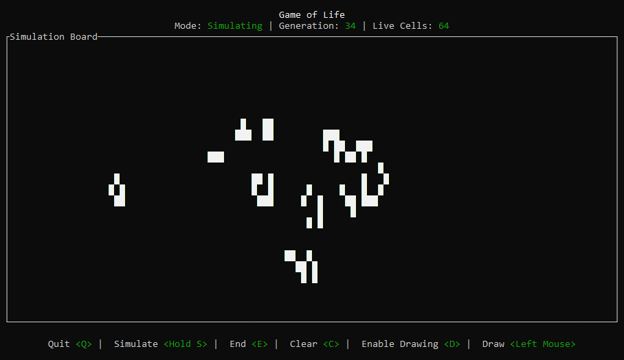

# Game of Life - Terminal Simulation

A terminal-based implementation of the **Conway's Game of Life**, written in Rust. The game simulates the life cycle of cells based on specific rules and updates the board each generation. It uses the [`ratatui`](https://github.com/ratatui/ratatui) library for the terminal user interface.

---

## 📚 Game of Life Rules

1. **Survival**: A live cell with 2 or 3 neighbors remains alive.
2. **Death by Underpopulation**: A live cell with fewer than 2 neighbors dies.
3. **Death by Overpopulation**: A live cell with more than 3 neighbors dies.
4. **Birth**: A dead cell with exactly 3 live neighbors becomes alive.

---

## 🎯 Gameplay

- **Drawing Mode**: Use the mouse to click and drag to draw live cells on the board.
- **Simulation Mode**: Once drawing is complete, start the simulation by pressing `S` (hold `S` or move the mouse). The simulation will run one generation at a time, applying the Game of Life rules (above).
- **Ending the Simulation**: Press `E` to stop the simulation and return to drawing mode.

---


## 🖼 Gallery



---


## 🎯 Controls

| Key  | Action                            |
|------|-----------------------------------|
| **left mouse click/drag** | Draw cells (click & drag with mouse) |
| **D** | Enable drawing |
| **S** | Simulate (hold for continuous simulation) |
| **E** | End simulation |
| **C** | Clear the board |
| **Q** | Quit the game |

---


## 🏗 Code Structure

📂 **Project Layout**

- [`src/main.rs`](src/main.rs) → Entry point of the application
- [`src/states`](src/states) → Game state management, including simulation and drawing modes
- [`src/components`](src/components) → UI components for rendering the board and displaying information
- [`src/helpers.rs`](src/helpers.rs) → Helper functions for simulation logic
- [`src/ui.rs`](src/ui.rs) → Terminal UI layout and rendering logic

--- 

## 🛠 Installation & Usage

1. Clone the repository:
   ```sh
   git clone https://github.com/yourusername/game-of-life-terminal.git
   cd game-of-life-terminal
   ```
2. Run the project using Cargo:
   ```sh
   cargo run
   ```

Once the application starts, you can interact with the simulation using the mouse to draw cells, press `T` to toggle drawing mode, press `S` to start the simulation, and press `E` to end it. The game will run in the terminal window.

---


## 🛠 Dependencies

- [`ratatui`](https://github.com/ratatui/ratatui) - Terminal UI framework for creating text-based interfaces
- [`crossterm`](https://github.com/crossterm-rs/crossterm) - Terminal input and output handling
- `std::collections` - Standard library collections for handling the board state

---

## 🙌 Acknowledgements

Special thanks to these amazing libraries:

- [`ratatui`](https://github.com/ratatui/ratatui) → Terminal UI framework for building the user interface
- [`crossterm`](https://github.com/crossterm-rs/crossterm) → Terminal input handling and event management
- **John Conway** for the original Game of Life concept

---

## 🎲 Enjoy playing Game of Life in the terminal! 🚀

Please star ⭐ this repo if you like it.

Feel free to contact me at [tijan@tijan.dev](mailto:tijan@tijan.dev) or visit my [website](https://tijan.dev/).
